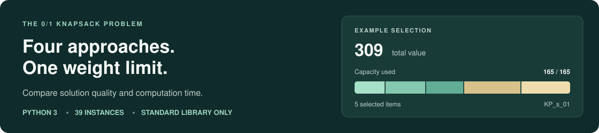

# Knapsack



**Choose the most valuable items that fit within a weight limit.** This project compares four approaches to the **0/1 knapsack problem**, where each item is either selected once or left out. Explore the tradeoff between solution quality and computation time using the included datasets, saved solutions, and search traces.

[Quick start](#quick-start) · [Algorithms](#algorithms) · [Example results](#example-results) · [Datasets](#datasets) · [Project notes](#project-notes)

## Quick start

Requires **Python 3** and Git. Uses only the Python standard library; there are no packages to install.

```bash
git clone https://github.com/vig-star/knapsack.git
cd knapsack/code
python3 project.py -inst ../DATA/DATASET/test/KP_s_01 -alg BnB -time 1
```

> [!IMPORTANT]
> Run the program from **`code/`**. Output paths are relative to the current working directory. If you already cloned the repository, start with `cd knapsack/code` from its parent directory.

The checked run found a total value of **309**, using all **165** units of capacity. The program prints the value and execution time, then saves the selection:

```bash
cat ../output/solution/KP_s_01_BnB_1.0.sol
```

```text
309.0
1, 1, 1, 1, 0, 1, 0, 0, 0, 0
```

The first line is the total value. Each flag on the second line corresponds to an item in the original input order: **`1` = selected**, **`0` = left out**.

## Algorithms

All four implementations live in [`code/project.py`](code/project.py).

| Option | Approach | Search strategy |
| --- | --- | --- |
| `BnB` | **Branch and bound** | Starts with a greedy result, explores include/exclude decisions, and prunes using a fractional-knapsack bound. |
| `Approx` | **Greedy approximation** | Orders items by value per unit weight, takes a prefix that fits, and compares with a single-item alternative. |
| `LS1` | **Local search with restarts** | Perturbs the greedy selection, then improves it by adding or removing individual items. |
| `LS2` | **Stochastic local search** | Adds swaps and randomized neighbor selection to the restart approach. Swaps are disabled at 5,000 or more items. |

Try the other approaches on the same input, from `code/`:

```bash
python3 project.py -inst ../DATA/DATASET/test/KP_s_01 -alg Approx -time 1
python3 project.py -inst ../DATA/DATASET/test/KP_s_01 -alg LS1 -time 1 -seed 32
python3 project.py -inst ../DATA/DATASET/test/KP_s_01 -alg LS2 -time 1 -seed 32
```

See the [running guide](code/README.md) for command-line options, file formats, and output naming.

## Example results

**Sample:** [`KP_s_01`](DATA/DATASET/test/KP_s_01) · **10 items** · **Capacity: 165** · **Time budget: 1 second** · **Local-search seed: 32**

| Algorithm | Total value | Weight used | Matches reference value? |
| --- | ---: | ---: | :---: |
| `BnB` | 309 | 165 / 165 | Yes |
| `Approx` | 266 | 127 / 165 | No |
| `LS1` | 309 | 165 / 165 | Yes |
| `LS2` | 309 | 165 / 165 | Yes |

All four saved selections passed capacity and value-consistency checks in this sample run. The [supplied reference selection](DATA/DATASET/test_solution/KP_s_01) totals 309. This is a smoke check on one instance; results can vary with input, time budget, and machine.

## Datasets

**39 instances** are included, ranging from **4 to 10,000 items**. Start with a test or small instance, then explore larger inputs.

| Collection | Instances | Items per instance | Reference format |
| --- | ---: | ---: | --- |
| [Test](DATA/DATASET/test/) | 8 | 5–24 | [One selection flag per line](DATA/DATASET/test_solution/) |
| [Small](DATA/DATASET/small_scale/) | 10 | 4–23 | [A single objective value](DATA/DATASET/small_scale_solution/) |
| [Large](DATA/DATASET/large_scale/) | 21 | 100–10,000 | [A single objective value](DATA/DATASET/large_scale_solution/) |

The [`output/`](output/) directory contains saved `.sol` selections and `.trace` progress records from earlier runs. Those runs use different time budgets, so they are examples to inspect rather than a comparison at equal budgets.

<details>
<summary><strong>Repository layout</strong></summary>

```text
knapsack/
├── README.md                 # Project overview
├── code/
│   ├── project.py            # CLI and four algorithm implementations
│   └── README.md             # Running guide and file formats
├── DATA/DATASET/             # Input instances and reference solutions
├── docs/assets/             # README artwork
└── output/
    ├── solution/             # Saved .sol results
    └── solution_trace/       # Saved .trace progress records
```

</details>

## Project notes

**Educational implementation.** The original solver code is preserved. Known correctness issues mean results should be checked before treating them as feasible, optimal, or covered by an approximation guarantee. There is no automated test suite; the example above verifies one instance.

<details>
<summary><strong>Known algorithm and timing limitations</strong></summary>

- **Approximation:** when the greedy prefix stops, the single-item comparison uses the item after the first rejected item and does not check its weight. The code comment's claimed 1/2 approximation guarantee should not be relied on.
- **Branch and bound:** inherits the greedy starting result and truncates a fractional bound contribution to an integer, even though fractional values are accepted. Feasibility and optimality are not guaranteed by this implementation.
- **Local search:** a cutoff can return an updated selection with its previous score. Recalculate the selected items' total weight and value before comparing results.
- **Timing and repeatability:** sorting or neighbor evaluation can exceed the requested time budget. A fixed seed controls random choices, but time-based stopping can change the final result across runs or machines.

</details>

<details>
<summary><strong>Original experiment environment</strong></summary>

The original experiments used Python 3.11 through Anaconda 3 on MacBook Air machines with Apple M1 and M2 chips, 8 CPU cores, and 8 GB RAM. The example commands were also checked with Python 3.9.6. Anaconda is not required.

</details>

---

Written by **Vignesh Sreedhar, Sai Manchikalapati, and Pranav Sreedhar**.
